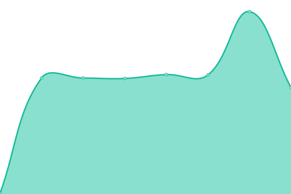

# [📈 Live Status](https://myc-rmt.github.io/upptime): <!--live status--> **🟥 Complete outage**

This repository contains the open-source uptime monitor and status page for [myc-rmt](https://myc-rmt.github.io/upptime), powered by [Upptime](https://github.com/upptime/upptime).

With [Upptime](https://upptime.js.org), you can get your own unlimited and free uptime monitor and status page, powered entirely by a GitHub repository. We use [Issues](https://github.com/myc-rmt/upptime/issues) as incident reports, [Actions](https://github.com/myc-rmt/upptime/actions) as uptime monitors, and [Pages](https://myc-rmt.github.io/upptime) for the status page.

<!--start: status pages-->
<!-- This summary is generated by Upptime (https://github.com/upptime/upptime) -->
<!-- Do not edit this manually, your changes will be overwritten -->
<!-- prettier-ignore -->
| URL | Status | History | Response Time | Uptime |
| --- | ------ | ------- | ------------- | ------ |
|  [EGU - Dota 2 News](https://my-egu.vercel.app/api/news/scrapeGoogle?topic=Dota%202) | 🟥 Down | [egu-dota-2-news.yml](https://github.com/myc-rmt/upptime/commits/HEAD/history/egu-dota-2-news.yml) | 

 2479ms
     
 | 

<a href="https://upptime.myc.com.my/history/egu-dota-2-news">0.00%</a>
    

|  [EGU - League of Legends News](https://my-egu.vercel.app/api/news/scrapeGoogle?topic=League%20of%20Legends) | 🟥 Down | [egu-league-of-legends-news.yml](https://github.com/myc-rmt/upptime/commits/HEAD/history/egu-league-of-legends-news.yml) | 

 280ms
     
 | 

<a href="https://upptime.myc.com.my/history/egu-league-of-legends-news">0.00%</a>
    

|  [EGU - Counter-Strike%3A Global Offensive News](https://my-egu.vercel.app/api/news/scrapeGoogle?topic=Counter-Strike%3A%20Global%20Offensive) | 🟥 Down | [egu-counter-strike-3-a-global-offensive-news.yml](https://github.com/myc-rmt/upptime/commits/HEAD/history/egu-counter-strike-3-a-global-offensive-news.yml) | 

 287ms
     
 | 

<a href="https://upptime.myc.com.my/history/egu-counter-strike-3-a-global-offensive-news">0.00%</a>
    

|  [EGU - Fortnite News](https://my-egu.vercel.app/api/news/scrapeGoogle?topic=Fortnite) | 🟥 Down | [egu-fortnite-news.yml](https://github.com/myc-rmt/upptime/commits/HEAD/history/egu-fortnite-news.yml) | 

 310ms
     
 | 

<a href="https://upptime.myc.com.my/history/egu-fortnite-news">0.00%</a>
    

|  [EGU - Apex Legends News](https://my-egu.vercel.app/api/news/scrapeGoogle?topic=Apex%20Legends) | 🟥 Down | [egu-apex-legends-news.yml](https://github.com/myc-rmt/upptime/commits/HEAD/history/egu-apex-legends-news.yml) | 

 295ms
     
 | 

<a href="https://upptime.myc.com.my/history/egu-apex-legends-news">0.00%</a>
    

|  [EGU - VALORANT News](https://my-egu.vercel.app/api/news/scrapeGoogle?topic=VALORANT) | 🟥 Down | [egu-valorant-news.yml](https://github.com/myc-rmt/upptime/commits/HEAD/history/egu-valorant-news.yml) | 

 283ms
     
 | 

<a href="https://upptime.myc.com.my/history/egu-valorant-news">0.00%</a>
    

|  [EGU - PLAYERUNKNOWN%27S BATTLEGROUNDS News](https://my-egu.vercel.app/api/news/scrapeGoogle?topic=PLAYERUNKNOWN%27S%20BATTLEGROUNDS) | 🟥 Down | [egu-playerunknown-27-s-battlegrounds-news.yml](https://github.com/myc-rmt/upptime/commits/HEAD/history/egu-playerunknown-27-s-battlegrounds-news.yml) | 

 274ms
     
 | 

<a href="https://upptime.myc.com.my/history/egu-playerunknown-27-s-battlegrounds-news">0.00%</a>
    

|  [EGU - Overwatch News](https://my-egu.vercel.app/api/news/scrapeGoogle?topic=Overwatch) | 🟥 Down | [egu-overwatch-news.yml](https://github.com/myc-rmt/upptime/commits/HEAD/history/egu-overwatch-news.yml) | 

 276ms
     
 | 

<a href="https://upptime.myc.com.my/history/egu-overwatch-news">0.00%</a>
    

|  [EGU - Call of Duty News](https://my-egu.vercel.app/api/news/scrapeGoogle?topic=Call%20of%20Duty) | 🟥 Down | [egu-call-of-duty-news.yml](https://github.com/myc-rmt/upptime/commits/HEAD/history/egu-call-of-duty-news.yml) | 

 286ms
     
 | 

<a href="https://upptime.myc.com.my/history/egu-call-of-duty-news">0.00%</a>
    

|  [FRESHFACES](https://freshfaces.vercel.app/api/cron/ping) | 🟥 Down | [freshfaces.yml](https://github.com/myc-rmt/upptime/commits/HEAD/history/freshfaces.yml) | 

 194ms
     
 | 

<a href="https://upptime.myc.com.my/history/freshfaces">0.00%</a>
    

<!--end: status pages-->

[**Visit our status website →**](https://myc-rmt.github.io/upptime)

## 📄 License

- Code: [MIT](./LICENSE) © [myc-rmt](https://myc-rmt.github.io/upptime)
- Data in the `./history` directory: [Open Database License](https://opendatacommons.org/licenses/odbl/1-0/)
