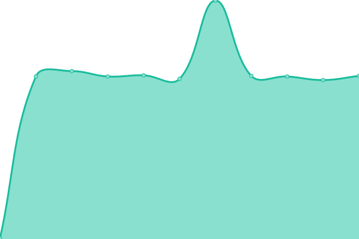

# [📈 Live Status](https://myc-rmt.github.io/upptime): <!--live status--> **🟧 Partial outage**

This repository contains the open-source uptime monitor and status page for [myc-rmt](https://myc-rmt.github.io/upptime), powered by [Upptime](https://github.com/upptime/upptime).

With [Upptime](https://upptime.js.org), you can get your own unlimited and free uptime monitor and status page, powered entirely by a GitHub repository. We use [Issues](https://github.com/myc-rmt/upptime/issues) as incident reports, [Actions](https://github.com/myc-rmt/upptime/actions) as uptime monitors, and [Pages](https://myc-rmt.github.io/upptime) for the status page.

<!--start: status pages-->
<!-- This summary is generated by Upptime (https://github.com/upptime/upptime) -->
<!-- Do not edit this manually, your changes will be overwritten -->
<!-- prettier-ignore -->
| URL | Status | History | Response Time | Uptime |
| --- | ------ | ------- | ------------- | ------ |
| [EGU - Dota 2 News](https://my-egu.vercel.app/api/news/scrapeGoogle?topic=Dota%202) | 🟩 Up | [egu-dota-2-news.yml](https://github.com/myc-rmt/upptime/commits/master/history/egu-dota-2-news.yml) | 

 6701ms
     
 | 

   

| [EGU - League of Legends News](https://my-egu.vercel.app/api/news/scrapeGoogle?topic=League%20of%20Legends) | 🟩 Up | [egu-league-of-legends-news.yml](https://github.com/myc-rmt/upptime/commits/master/history/egu-league-of-legends-news.yml) | 

 1133ms
     
 | 

   

| [EGU - Counter-Strike%3A Global Offensive News](https://my-egu.vercel.app/api/news/scrapeGoogle?topic=Counter-Strike%3A%20Global%20Offensive) | 🟩 Up | [egu-counter-strike-3-a-global-offensive-news.yml](https://github.com/myc-rmt/upptime/commits/master/history/egu-counter-strike-3-a-global-offensive-news.yml) | 

 978ms
     
 | 

   

| [EGU - Fortnite News](https://my-egu.vercel.app/api/news/scrapeGoogle?topic=Fortnite) | 🟩 Up | [egu-fortnite-news.yml](https://github.com/myc-rmt/upptime/commits/master/history/egu-fortnite-news.yml) | 

 1003ms
     
 | 

   

| [EGU - Apex Legends News](https://my-egu.vercel.app/api/news/scrapeGoogle?topic=Apex%20Legends) | 🟩 Up | [egu-apex-legends-news.yml](https://github.com/myc-rmt/upptime/commits/master/history/egu-apex-legends-news.yml) | 

 1037ms
     
 | 

   

| [EGU - VALORANT News](https://my-egu.vercel.app/api/news/scrapeGoogle?topic=VALORANT) | 🟩 Up | [egu-valorant-news.yml](https://github.com/myc-rmt/upptime/commits/master/history/egu-valorant-news.yml) | 

 421ms
     
 | 

   

| [EGU - PLAYERUNKNOWN%27S BATTLEGROUNDS News](https://my-egu.vercel.app/api/news/scrapeGoogle?topic=PLAYERUNKNOWN%27S%20BATTLEGROUNDS) | 🟩 Up | [egu-playerunknown-27-s-battlegrounds-news.yml](https://github.com/myc-rmt/upptime/commits/master/history/egu-playerunknown-27-s-battlegrounds-news.yml) | 

 558ms
     
 | 

   

| [EGU - Overwatch News](https://my-egu.vercel.app/api/news/scrapeGoogle?topic=Overwatch) | 🟩 Up | [egu-overwatch-news.yml](https://github.com/myc-rmt/upptime/commits/master/history/egu-overwatch-news.yml) | 

 945ms
     
 | 

   

| [EGU - Call of Duty News](https://my-egu.vercel.app/api/news/scrapeGoogle?topic=Call%20of%20Duty) | 🟩 Up | [egu-call-of-duty-news.yml](https://github.com/myc-rmt/upptime/commits/master/history/egu-call-of-duty-news.yml) | 

 1203ms
     
 | 

   

| [FRESHFACES - Scraper - vogue.co.uk](https://freshfaces.vercel.app/api/scraper/vogue.co.uk) | 🟥 Down | [freshfaces-scraper-vogue-co-uk.yml](https://github.com/myc-rmt/upptime/commits/master/history/freshfaces-scraper-vogue-co-uk.yml) | 

 8953ms
     
 | 

   

| [FRESHFACES - Scraper - allure.com](https://freshfaces.vercel.app/api/scraper/allure.com) | 🟥 Down | [freshfaces-scraper-allure-com.yml](https://github.com/myc-rmt/upptime/commits/master/history/freshfaces-scraper-allure-com.yml) | 

 1141ms
     
 | 

   

<!--end: status pages-->

[**Visit our status website →**](https://myc-rmt.github.io/upptime)

## 📄 License

- Code: [MIT](./LICENSE) © [myc-rmt](https://myc-rmt.github.io/upptime)
- Data in the `./history` directory: [Open Database License](https://opendatacommons.org/licenses/odbl/1-0/)
